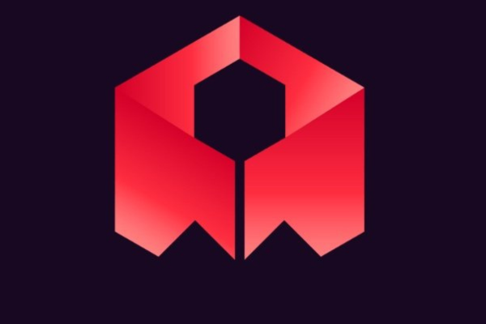
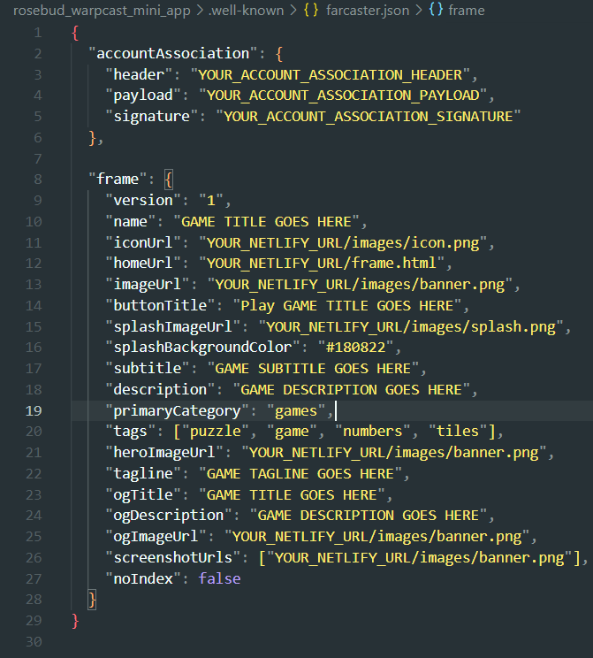

# Warpcast Mini-App

<div align="center">
  
</div>

## Overview

This repository contains a ready-to-deploy Warpcast Mini-App. You can convert a vibe-coded game on Rosebud AI into your own mini-app own Warpcast/Farcaster

## Prerequisites

- GitHub account (for cloning the repository)
- [Netlify](https://www.netlify.com/) account (for deployment)
- [Warpcast](https://www.warpcast.com/) account (for Mini-App setup)
- [Rosebud AI](https://www.rosebud.ai/) game URL

## Deployment Guide

### Step 1: Get the Code

Clone the repository:
```bash
git clone https://github.com/meghm1007/rosebud_warpcast_mini_app.git
cd rosebud_warpcast_mini_app
```

<div align="center">
  
</div>

### Step 2: Update the TODO Items

Several files contain TODO comments that indicate what you need to change:

1. **index.html** - Look for these TODO comments:
   ```html
   <!-- TODO: CHANGE TITLE OF THE GAME -->
   <!-- TODO: CHANGE NETLIFY URL -->
   <!-- TODO: CHANGE DESCRIPTION OF THE GAME -->
   ```

2. **frame.html** - Look for these TODO comments:
   ```html
   <!-- TODO: CHANGE TITLE OF THE GAME -->
   <!-- TODO: ADD YOUR NETLIFY URL -->
   <!-- TODO: CHANGE DESCRIPTION OF THE GAME -->
   ```
   
   And in the script section:
   ```javascript
   //TODO: CHANGE THESE VALUES
   //TODO: ADD YOUR ROSEBUD GAME URL
   //TODO: CHANGE THE GAME TITLE AND DESCRIPTION
   //TODO: CHANGE THE BUTTONS TEXT AND ICONS
   ```

3. **api/frame.js** - Replace all occurrences of `YOUR_NETLIFY_URL` with your actual Netlify URL.

<div align="center">
  
</div>

### Step 3: Deploy to Netlify

1. Go to [Netlify](https://app.netlify.com/)
2. Sign in or create an account
3. Click "Add new site" > "Deploy manually"
4. Drag and drop this entire folder onto the Netlify dashboard
5. Wait for deployment to complete
6. Copy your new Netlify URL (e.g., `random-name-123456.netlify.app`)

<div align="center">
  
</div>

### Step 4: Update Configuration Files

After getting your Netlify URL, go back and update all the instances of `YOUR_NETLIFY_URL` in your files.

> **💡 Pro Tip:** Use your editor's search and replace functionality to quickly replace all placeholder values:
> - Windows/Linux: `Ctrl + Shift + F` 
> - Mac: `Command + Shift + F`
> - Search for `YOUR_NETLIFY_URL` and replace all instances with your actual Netlify URL
> - Do the same for `YOUR_ROSEBUD_GAME_URL` and replace it with the actual Rosebud link

Replace placeholder values in the **index.html**, **frame.html**, and **api/frame.js**👆🏻

Make sure you even change the values in the **/well-known/farcaster.json** file as well

The reason why you need to make the same changes to so many placeholders is that each of the placeholders has a different functionality - one for the frame preview, one for hosting, etc.

<div align="center">
  
</div>

<div align="center">
  
</div>

 **Images** (Optional):
   - Update images in the `/images` folder as needed
   - Recommended image sizes:
     - icon.png: 512x512px (square)
     - banner.png: 1200x630px (1.91:1 ratio)
     - splash.png: 1200x1200px (square)

### Step 5: Generate Account Association Values

1. Go to [Warpcast Developers Mini Apps Manifest Tool](https://warpcast.com/~/developers/mini-apps/manifest)
2. Enter your Netlify URL (e.g., `random-name-123456.netlify.app`)
3. Click "Verify Domain"
4. Scan the QR code with your Warpcast mobile app
5. This will generate your accountAssociation values
6. Copy the generated values and update `.well-known/farcaster.json`:
   ```json
   "accountAssociation": {
     "header": "YOUR_ACCOUNT_ASSOCIATION_HEADER",
     "payload": "YOUR_ACCOUNT_ASSOCIATION_PAYLOAD",
     "signature": "YOUR_ACCOUNT_ASSOCIATION_SIGNATURE"
   }
   ```

<div align="center">
  
</div>

### Step 6: Final Deployment

After updating all the configuration files, redeploy your project to Netlify using the same process as in Step 2.

### Step 7: Test and Publish Your Mini-App

1. Go to [Warpcast Developers Mini Apps Debug Tool](https://warpcast.com/~/developers/mini-apps/debug)
2. Enter your Netlify URL
3. Click "Preview" to test your mini-app
4. If everything works correctly, click "Add to Warpcast"
5. Your mini-app is now available in the Warpcast store!

<div align="center">
  
</div>

## Sharing Your Mini-App

Create a new cast on Warpcast and paste your mini-app URL (your Netlify URL). When users click on the link, they'll be able to access and use your mini-app.

<div align="center">
  
</div>

## Troubleshooting

### URL Format Issues

> ⚠️ **Important:** When replacing URL placeholders, use the correct format

✅ **Correct format**: `https://your-site-name.netlify.app`  
❌ **Incorrect formats**:
- `https://your-site-name.netlify.app/` (trailing slash)
- `https://your-site-name.netlify.app/frame.html` (specific page)

### Loading Issues in Warpcast

If your mini-app doesn't load when sharing the Netlify link in Warpcast, try this simple fix:

1. Delete the link from your cast
2. Refresh the page 
3. Paste the link again

You may need to repeat this process a few times. This is typically just a caching issue that resolves itself.

<div align="center">
  
</div>

## Advanced Customization

You can fully customize your mini-app by modifying:

- **Visual Design**: Change colors, fonts, and layouts by editing the CSS in frame.html
- **Game Integration**: Replace the Rosebud game with any iframe-compatible app
- **Functionality**: Add new features, animations, or game mechanics
- **Buttons and Controls**: Modify the game controls to match your concept

## Acknowledgments

- [Rosebud AI](https://www.rosebud.ai)
- [Warpcast/Farcaster](https://www.warpcast.com)
- [Netlify](https://www.netlify.com)