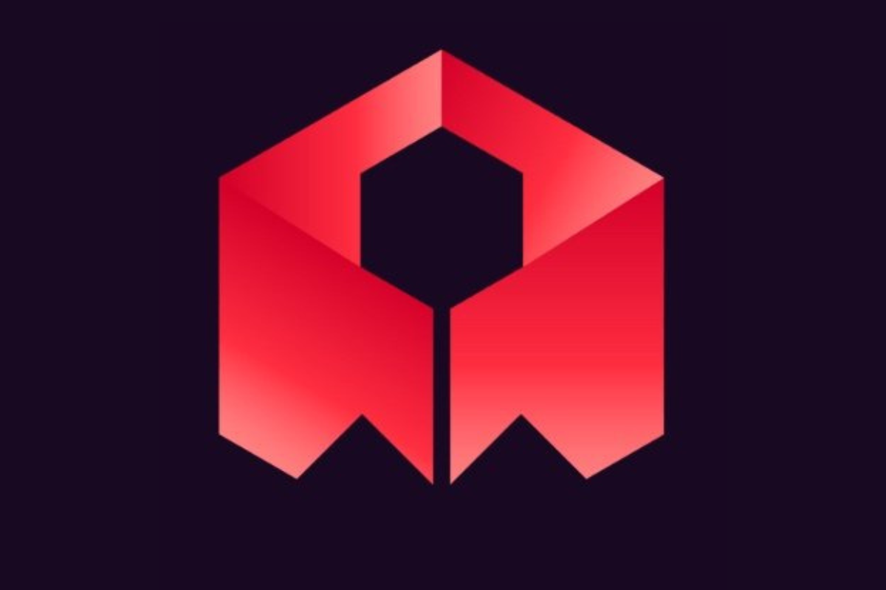

# 1024 - Warpcast Mini-App

<div align="center">
  
  <p>A fun mini-app game where you surf the sky and collect coins!</p>
</div>

## Overview

This repository contains a ready-to-deploy Warpcast Mini-App that embeds the 1024 game. The game is a fun sky surfing experience where players collect coins while navigating through the air.

## Prerequisites

- GitHub account (for cloning the repository)
- Netlify account (for deployment)
- Warpcast account (for Mini-App setup)
- Rosebud.ai game URL (optional - you can use your own game URL)

## Deployment Guide

### Step 1: Get the Code

Clone the repository:
```bash
git clone https://github.com/meghm1007/rosebud_warpcast_mini_app.git
cd rosebud_warpcast_mini_app
```

### Step 2: Deploy to Netlify

1. Go to [Netlify](https://app.netlify.com/)
2. Sign in or create an account
3. Click "Add new site" > "Deploy manually"
4. Drag and drop this entire folder onto the Netlify dashboard
5. Wait for deployment to complete
6. Copy your new Netlify URL (e.g., `random-name-123456.netlify.app`)

### Step 3: Update Configuration Files

Replace placeholder values in the following files:

1. **index.html**:
   - Replace all instances of `YOUR_NETLIFY_URL` with your actual Netlify URL

2. **frame.html**:
   - Replace all instances of `YOUR_NETLIFY_URL` with your actual Netlify URL
   - Replace `YOUR_ROSEBUD_GAME_URL` with your Rosebud game URL
     - You can get a Rosebud game URL from [rosebud.ai](https://rosebud.ai)

3. **api/frame.js**:
   - Replace all instances of `YOUR_NETLIFY_URL` with your actual Netlify URL

4. **.well-known/farcaster.json**:
   - Replace all instances of `YOUR_NETLIFY_URL` with your actual Netlify URL
   - The accountAssociation values will be updated in Step 5

5. **Images** (Optional):
   - Update images in the `/images` folder as needed
   - Recommended image sizes:
     - icon.png: 512x512px (square)
     - banner.png: 1200x630px (1.91:1 ratio)
     - splash.png: 1200x1200px (square)

### Step 4: Generate Account Association Values

1. Go to [Warpcast Developers Mini Apps Manifest Tool](https://warpcast.com/~/developers/mini-apps/manifest)
2. Enter your Netlify URL (e.g., `random-name-123456.netlify.app`)
3. Click "Verify Domain"
4. Scan the QR code with your Warpcast mobile app
5. This will generate your accountAssociation values
6. Copy the generated values and update `.well-known/farcaster.json`:
   ```json
   "accountAssociation": {
     "header": "YOUR_ACCOUNT_ASSOCIATION_HEADER",
     "payload": "YOUR_ACCOUNT_ASSOCIATION_PAYLOAD",
     "signature": "YOUR_ACCOUNT_ASSOCIATION_SIGNATURE"
   }
   ```

### Step 5: Final Deployment

After updating all the configuration files, redeploy your project to Netlify using the same process as in Step 2.

### Step 6: Test and Publish Your Mini-App

1. Go to [Warpcast Developers Mini Apps Debug Tool](https://warpcast.com/~/developers/mini-apps/debug)
2. Enter your Netlify URL
3. Click "Preview" to test your mini-app
4. If everything works correctly, click "Add to Warpcast"
5. Your mini-app is now available in the Warpcast store!

## Sharing Your Mini-App

Create a new cast on Warpcast and paste your mini-app URL (your Netlify URL). When users click on the link, they'll be able to access and use your mini-app.

## Troubleshooting

- If your mini-app doesn't appear correctly, check that all URLs have been properly updated
- Make sure your `.well-known/farcaster.json` file is accessible at your domain
- Verify that your accountAssociation values are correct
- Check that your images are properly sized and accessible

## Resources

- [Farcaster Mini Apps Documentation](https://miniapps.farcaster.xyz/)
- [Warpcast Developers Portal](https://warpcast.com/~/developers)
- [Netlify Documentation](https://docs.netlify.com/)

## License

This project is licensed under the MIT License - see the LICENSE file for details.

## Acknowledgments

- Rosebud.ai for the game engine
- Farcaster for the Mini-Apps platform
- Warpcast for the client support
